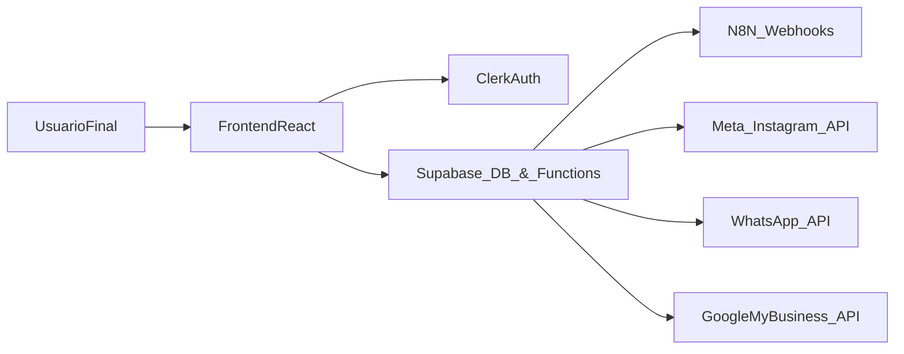

# Arquitetura — Cliente Ideal Online

## Visão geral

O **Cliente Ideal Online** é uma aplicação **SPA** (Single Page Application) em React que consome o backend baseado em **Supabase** (PostgreSQL + RLS + Edge Functions). A autenticação é feita via **Clerk**, que emite JWTs usados pelo Supabase para aplicar as políticas de Row Level Security.



- **Frontend**: renderiza a UI, gerencia estado de UX e orquestra chamadas para Supabase e Edge Functions.
- **Supabase**: concentra banco de dados, RLS e lógica de negócio sensível nas Edge Functions.
- **Clerk**: gerencia identidade, login, convites de vendedores e fornece JWT para o Supabase.
- **n8n**: processa fluxos de IA (chat de conhecimento, briefing, Evolution/WhatsApp legado).
- **APIs externas**: Meta/Instagram, WhatsApp Cloud API, Google My Business (Social Hub).

---

## Camadas principais

| Camada      | Responsabilidade                                                    |
|------------|----------------------------------------------------------------------|
| UI         | Páginas React, componentes Radix, formulários, feedback de usuário |
| Estado     | Estado local/contexts para UX (filtros, seleção, loading, etc.)    |
| Roteamento | Rotas públicas e protegidas (React Router v7)                       |
| Auth       | Sessão via Clerk, roles e metadados                                 |
| Dados      | Supabase (tabelas com RLS)                                          |
| Backend    | Edge Functions (clerk, chat, integrações externas, admin SaaS)     |

---

## Frontend (React + Vite)

### Organização geral

Principais diretórios:

- `src/pages/auth/*`: páginas de autenticação, callbacks e fluxos de integração.
- `src/pages/dashboard/*`: módulos de negócio (leads, oportunidades, indicadores, consórcio, etc.).
- `src/pages/admin/*`: painel do **Admin SaaS**.
- `src/components/*`: componentes reutilizáveis (UI, layouts, formulários, etc.).
- `src/lib/*`: configuração do Supabase client, helpers, hooks de integrações.

### Roteamento e proteção

- As rotas são organizadas com **React Router v7**.
- Um componente `ProtectedRoute` garante que:
  - o usuário esteja autenticado no Clerk;
  - haja uma empresa/plano associado antes de acessar o dashboard;
  - roles específicas sejam exigidas para rotas de admin SaaS (`/admin/*`).
- **Nota:** checks no frontend são apenas UX; a autorização real é garantida via RLS e validação nas Edge Functions.

---

## Módulos do dashboard

Os módulos de negócio descritos em detalhe em `docs/DOCUMENTACAO_SISTEMA_V1.md` compartilham o mesmo padrão:

- Rotas em `src/pages/dashboard/<modulo>`.
- Tabelas específicas no Supabase com coluna `company_id`.
- RLS garantindo isolamento por empresa.

Principais módulos:

- **Cliente Ideal / ICP** (`/dashboard/cliente-ideal/*`).
- **Qualificadores** (`/dashboard/qualificador` e contexto por persona).
- **Leads** e **Oportunidades** (`/dashboard/leads`, `/dashboard/oportunidades`).
- **Agenda** (`/dashboard/agenda`).
- **Atendimentos IA** (`/dashboard/atendimentos`).
- **Base de Conhecimento** e **Chat de Conhecimento**.
- **Produtos/Serviços (Items)**.
- **Indicadores** (`/dashboard/indicadores`), incluindo insights de redes sociais.
- **Consórcio** (`/dashboard/consorcio`).
- **Configurações** (`/dashboard/configuracoes`) e **Vendedores** (`/dashboard/vendedores`).
- **Admin SaaS** (`/admin/*`) para visão global do SaaS.

---

## Backend — Supabase

### Banco de dados e RLS

- Tabelas de negócio sempre incluem `company_id`.
- Políticas de RLS seguem o padrão:

```sql
company_id IN (
  SELECT company_id
  FROM profiles
  WHERE id = (auth.jwt() ->> 'sub')
    AND company_id IS NOT NULL
);
```

- O JWT do Clerk é emitido usando template `supabase`, garantindo que `sub` seja o `userId` do Clerk.

### Edge Functions

As Edge Functions concentram:

- **Integração com Clerk** (webhook de criação de usuário, convites de vendedores, sync de perfil).
- **Admin SaaS** (listagem de usuários/empresas, configuração de webhooks n8n, Evolution API, GTM).
- **Chat de Conhecimento** (proxy para n8n, montagem de payload e isolamento por segmento).
- **Integrações de comunicação**:
  - Evolution API (legado) via `evolution-proxy` e `evolution-webhook`.
  - Nova integração WhatsApp via Cloud API em `supabase/functions/whatsapp-integration`.
- **Integrações sociais**:
  - Meta/Instagram em `supabase/functions/meta-instagram`.
  - Google My Business / Social Hub em `supabase/functions/gmb-post-create`.

Lista completa e descrição detalhada das funções está em `docs/DOCUMENTACAO_SISTEMA_V1.md`.

---

## Integrações externas (visão de arquitetura)

### Clerk

- Responsável por login/signup, convites e roles.
- Envia eventos via webhook para Edge Function que cria/atualiza `companies` e `profiles`.
- Secret Key (`CLERK_SECRET_KEY`) é usada apenas nas Edge Functions para validar tokens.

### n8n

- Usado como orquestrador para:
  - Chat de conhecimento;
  - Fluxos de briefing estratégico;
  - Processamento de mensagens recebidas via Evolution API (quando habilitado).
- URLs de webhooks ficam em tabelas de configuração admin (`admin_webhook_config`) e **não** são hardcoded no frontend.

### WhatsApp

Existem dois caminhos principais:

- **Evolution API (legado)**:
  - Proxy `evolution-proxy` para enviar comandos a partir do frontend sem expor a API Key.
  - Webhook `evolution-webhook` para receber mensagens.
- **WhatsApp Cloud API (Meta)**:
  - Nova função `whatsapp-integration` realiza fluxo OAuth com Meta, obtém WABA e números, e persiste em tabela de integrações.
  - O frontend interage apenas com essa função, nunca direto com a API do Facebook/Meta.

### Meta/Instagram & Social Hub

- Funções dedicadas:
  - `meta-instagram`: fluxo de autenticação e armazenamento de tokens/perfis.
  - `gmb-post-create`: criação de posts para Google My Business a partir do módulo Social Hub.
- Páginas de callback em `src/pages/auth/*` fazem a ponte entre o fluxo OAuth e o dashboard.

---

## Segurança na arquitetura

- **Backend como fonte de verdade**: qualquer decisão de permissão crítica (acesso a dados de empresa, alteração de planos, consumo de integrações) passa pela RLS ou por Edge Functions tipadas.
- **Nada de segredos no cliente**: apenas variáveis `VITE_*` são expostas, e todas são chaves públicas (Supabase anon, publishable key do Clerk, URLs públicas).
- **Validação em duas camadas**:
  - UX: validação com zod no frontend.
  - Segurança: validação adicional nas Edge Functions e no banco.
- **Proteção contra XSS**:
  - Conteúdos HTML dinâmicos passam por DOMPurify.
  - Uso cuidadoso de `dangerouslySetInnerHTML` (quando necessário) sempre com sanitização prévia.

Para detalhes de políticas e recomendações, veja também `docs/security.md`.

