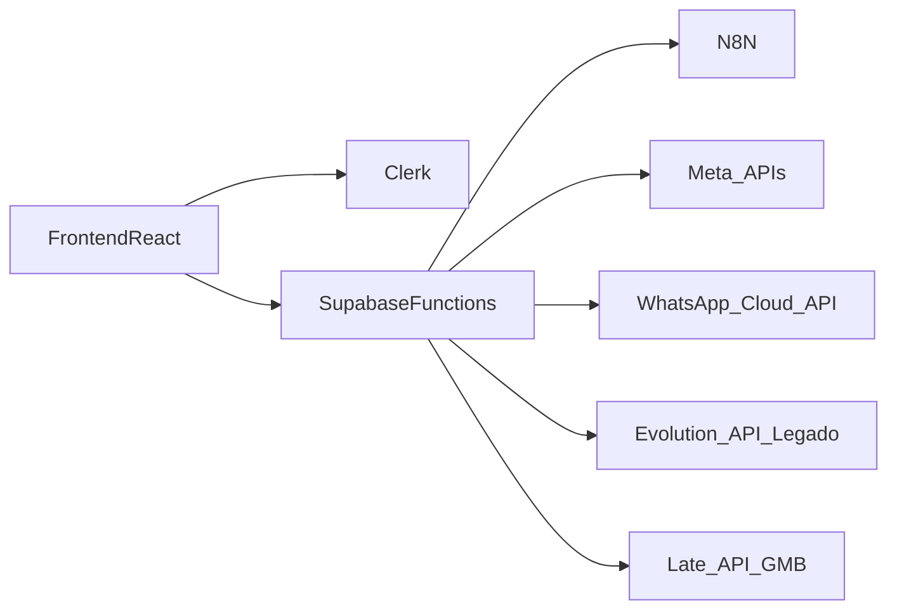

# Integrações — Cliente Ideal Online

Este documento resume as principais integrações externas do sistema, com foco em **fluxo de dados**, **segurança** e **pontos de configuração**. Para detalhes de módulos e rotas, consulte também `docs/DOCUMENTACAO_SISTEMA_V1.md`.

---

## Visão geral das integrações



- O **frontend nunca envia secrets** diretamente para APIs externas.
- Todas as chamadas sensíveis passam por **Edge Functions** com validação de JWT do Clerk e uso de **Service Role Key** do Supabase quando necessário.
- Tokens de terceiros (Meta, WhatsApp, etc.) são armazenados em tabelas próprias e/ou criptografados, nunca retornados ao cliente.

---

## Clerk (autenticação e identidade)

- Usado para:
  - Login/signup de usuários do SaaS.
  - Convite de vendedores para empresas específicas (via metadata).
  - Atribuição de roles (`admin` SaaS, admin de empresa, vendedor).
- Integração com Supabase:
  - Template JWT `supabase`, de forma que `auth.jwt() ->> 'sub'` corresponde ao `userId` do Clerk.
  - RLS utiliza `profiles.company_id` vinculado ao `sub`.
- Documentos relacionados:
  - [`docs/SETUP-CLERK-SUPABASE-AUTH.md`](./SETUP-CLERK-SUPABASE-AUTH.md)
  - [`docs/SETUP-CLERK-SECRET.md`](./SETUP-CLERK-SECRET.md)

---

## n8n (chat de conhecimento, briefing, WhatsApp legado)

- O n8n é o orquestrador de fluxos de automação, incluindo:
  - **Chat de Conhecimento** (Edge Function `chat-conhecimento-proxy`).
  - **Briefing Estratégico** (coleta de respostas e envio para webhook).
  - Processamento de mensagens recebidas via Evolution API (quando habilitado).
- Configurações por segmento:
  - Tabela `admin_webhook_config` armazena URLs de webhooks por `segment_type`.
  - Empresas são associadas a um segmento; Edge Functions leem a URL correta para montar o payload.
- O frontend **sempre chama o proxy** (`chat-conhecimento-proxy`, `upload-kb-to-webhook`, etc.); nunca chama webhooks do n8n diretamente.

---

## WhatsApp — Evolution API (legado)

### Visão

- Integração original com **Evolution API**:
  - Edge Function `evolution-proxy` envia comandos para instância configurada.
  - Edge Function `evolution-webhook` recebe mensagens e eventos da Evolution.
  - Configurações globais em `admin_evolution_config` (URL base, API Key).
- Uso principal:
  - Atendimentos de IA.
  - Criação de leads a partir de conversas.

### Segurança

- API Key da Evolution é armazenada apenas em:
  - Tabela de configuração (quando necessário).
  - Secrets de Edge Functions (quando usada).
- O frontend **nunca vê** a API Key; apenas chama `evolution-proxy` com ações pré-definidas.

> A documentação detalhada dessa integração está em `docs/DOCUMENTACAO_SISTEMA_V1.md` (seção de Evolution API).

---

## WhatsApp — Meta / WhatsApp Cloud API

### Edge Function `whatsapp-integration`

Arquivo: `supabase/functions/whatsapp-integration/index.ts`

Fluxos principais (`action` no body):

- `"getLoginUrl"`:
  - Retorna a URL de OAuth da Meta para conectar a conta do WhatsApp Business.
  - Usa `META_APP_ID`, `META_WHATSAPP_REDIRECT_URI` e escopos `WHATSAPP_SCOPES`.
- `"exchangeCode"`:
  - Troca o `code` da Meta por `access_token` e obtém:
    - **WABA** (WhatsApp Business Account) do usuário.
    - Lista de números de telefone associados.
  - Persiste a integração na tabela `integrations` com:
    - `user_id` (sub do Clerk).
    - `provider = "whatsapp"`.
    - `access_token`, `waba_id`, `expires_at`.
- `"getPhoneNumbers"`:
  - Reutiliza o `access_token` salvo para listar números disponíveis para a WABA associada.
- `"selectPhoneNumber"`:
  - Atualiza o `phone_number_id` escolhido na tabela `integrations`.

### Fluxo no frontend

- Início da conexão:
  - O dashboard chama a função com `action: "getLoginUrl"` e redireciona o usuário para a URL retornada.
  - O estado (`state`) de OAuth é salvo em `sessionStorage` (`whatsapp_oauth_state`).
- Callback:
  - Página `WhatsappCallbackPage` (`src/pages/auth/WhatsappCallbackPage.tsx`) lê `code` e `state` da URL.
  - Valida o `state` com `sessionStorage`.
  - Obtém o JWT do Clerk (`getToken()`) e envia para a Edge Function:
    - Chamada para `${SUPABASE_URL}/functions/v1/whatsapp-integration` com `action: "exchangeCode"`.
- Pós-conexão:
  - Após sucesso, o usuário é redirecionado para `/dashboard/configuracoes?tab=integracoes&whatsapp_flow=select` para escolher o número.

### Segurança

- JWT do Clerk é validado via `verifyToken` com `CLERK_SECRET_KEY` nas Edge Functions.
- Access tokens da Meta não são enviados para o cliente; apenas dados derivados (números, WABA, etc.).
- Tabela `integrations` guarda tokens e metadados; acesso controlado por `user_id` e RLS.

---

## Meta / Instagram

### Edge Function `meta-instagram`

Arquivo: `supabase/functions/meta-instagram/index.ts`

Principais ações (`action` no body):

- `"getLoginUrl"`:
  - Gera URL de OAuth da Meta usando:
    - `META_APP_ID`, `META_REDIRECT_URI`, `META_SCOPES`, `META_GRAPH_VERSION`.
- `"exchangeCode"`:
  - Troca `code` por `access_token`.
  - Criptografa o token com `META_TOKEN_ENCRYPTION_KEY` usando AES-GCM.
  - Persiste em `meta_instagram_integrations` com `company_id`, `scopes` e `token_expires_at`.
- `"listAccounts"`:
  - Usa o token descriptografado para chamar `/me/accounts?fields=name,instagram_business_account`.
  - Retorna lista de páginas Facebook + IDs de contas Instagram associadas.
- `"selectAccount"`:
  - Atualiza a linha de `meta_instagram_integrations` com:
    - `selected_page_id`, `selected_page_name`.
    - `selected_instagram_id`, `selected_instagram_username`.
- `"getInsights"` / `"getInstagramOverview"`:
  - Busca métricas de `reach` diárias para o Instagram Business ID indicado (ou selecionado).
  - Normaliza os dados em um formato simples para gráficos no frontend.
- `"getFacebookOverview"`:
  - Resolve o **page access token** via `/me/accounts`.
  - Busca métricas básicas de impressões da página (`page_impressions`).
- `"disconnect"`:
  - Remove a linha de `meta_instagram_integrations` para a empresa.

### Fluxo no frontend

- Início da conexão:
  - O dashboard chama `meta-instagram` com `action: "getLoginUrl"` e redireciona para a URL retornada.
  - Estado `meta_oauth_state` é salvo em `sessionStorage`.
- Callback:
  - Página `MetaInstagramCallbackPage` (`src/pages/auth/MetaInstagramCallbackPage.tsx`) lê `code` e `state`.
  - Valida `state` com `sessionStorage`.
  - Usa `getToken()` do Clerk para obter o JWT e envia para `meta-instagram` com `action: "exchangeCode"`.
- Pós-conexão:
  - A UI permite listar páginas e selecionar a combinação **Página + Instagram**.
  - Módulos como **Indicadores**/Social Hub consomem os endpoints de insights para montar gráficos.

### Segurança

- Tokens da Meta são criptografados em repouso com `META_TOKEN_ENCRYPTION_KEY`.
- Apenas métricas e dados agregados são enviados ao frontend.
- As Edge Functions sempre validam:
  - JWT do Clerk (`CLERK_SECRET_KEY`).
  - Associação da empresa via tabela `profiles`.

---

## Meta Connections para n8n

### Edge Function `meta-connections-n8n`

Arquivo: `supabase/functions/meta-connections-n8n/index.ts`

Retorna metadados das conexões Meta (Instagram, Facebook, Meta Ads) por empresa para uso em workflows n8n. **Não expõe tokens** — apenas IDs e nomes necessários para montar URLs (ex.: `instagram_business_id` para `media_publish`).

### Autenticação

- **Secret:** `N8N_META_CONNECTIONS_API_KEY` (configurar no Supabase Dashboard > Edge Functions > Secrets)
- **Método:** GET ou POST
- **Parâmetros:**
  - `company_id` (obrigatório): ID da empresa
  - `api_key`: valor de `N8N_META_CONNECTIONS_API_KEY`
- **Alternativa:** header `X-N8N-API-Key` com o valor da secret

### Exemplo de requisição (n8n HTTP Request)

```
GET https://<SUPABASE_PROJECT>.supabase.co/functions/v1/meta-connections-n8n?company_id=xxx&api_key=yyy
```

Ou POST com body:
```json
{
  "company_id": "uuid-da-empresa",
  "api_key": "seu-secret-compartilhado"
}
```

### Exemplo de resposta

```json
{
  "company_id": "uuid-da-empresa",
  "instagram": {
    "page_id": "812492191941463",
    "page_name": "Guaraná Viagens - Corporativo",
    "instagram_business_id": "17841477360734621",
    "instagram_username": "guarana_viagens"
  },
  "facebook": {
    "page_id": "812492191941463",
    "page_name": "Guaraná Viagens - Corporativo",
    "instagram_business_id": "17841477360734621",
    "instagram_username": "guarana_viagens"
  },
  "meta_ads": {
    "ad_account_id": "act_123456789",
    "ad_account_name": "Minha Conta de Anúncios"
  }
}
```

### Uso no n8n

- Use `instagram_business_id` na URL `https://graph.facebook.com/v23.0/{instagram_business_id}/media_publish` para publicar no Instagram.
- Use `page_id` para operações na página Facebook.
- O token de acesso da Meta deve ser obtido separadamente (configuração manual ou outro fluxo); esta API retorna apenas os IDs.

---

## Google My Business / Social Hub

### Edge Function `gmb-post-create`

Arquivo: `supabase/functions/gmb-post-create/index.ts`

- Função faz proxy para a **Late API** (`https://getlate.dev/api/v1/posts`) para criar posts no Google Business.
- Requisitos:
  - Header `Authorization: Bearer <clerk_jwt>` (JWT do Clerk).
  - Body: `{ content: string, mediaUrl?: string, accountId: string }`.
  - Secrets:
    - `CLERK_SECRET_KEY`
    - `LATE_API_KEY`
- Fluxo:
  1. Valida JWT do Clerk e obtém `sub`.
  2. Busca `company_id` e flag `saas_admin` em `profiles`.
  3. Verifica se o `accountId` pertence à empresa do usuário via tabela `gmb_accounts`.
  4. Lista contas na Late API (`/api/v1/accounts`) para garantir que o `accountId` pertence ao workspace correto.
  5. Cria o post em `LATE_API_URL` com `publishNow: true` e, opcionalmente, `mediaItems`.

### Segurança

- `LATE_API_KEY` nunca é exposta ao cliente; fica apenas nas secrets do Supabase.
- A função valida se o `accountId`:
  - Pertence a uma conta cadastrada em `gmb_accounts` para a empresa do usuário, **ou**
  - O usuário é `saas_admin`.
- Mensagens de erro ajudam a diagnosticar casos de accountId inválido ou workspace errado.

---

## Boas práticas ao consumir integrações no frontend

- Sempre chamar **Edge Functions** (via `${SUPABASE_URL}/functions/v1/...`) e nunca APIs externas diretamente.
- Enviar somente:
  - JWT do Clerk (via `getToken`) quando a função exigir autenticação de usuário.
  - Dados mínimos necessários para o fluxo (ex.: `code`, `state`, `accountId`, filtros de período).
- Tratar mensagens de erro retornadas pelas funções e exibir feedback amigável, sem vazar detalhes sensíveis (stack traces, payloads crus de provedores).

Para detalhes adicionais de segurança, consulte também `docs/security.md`.

